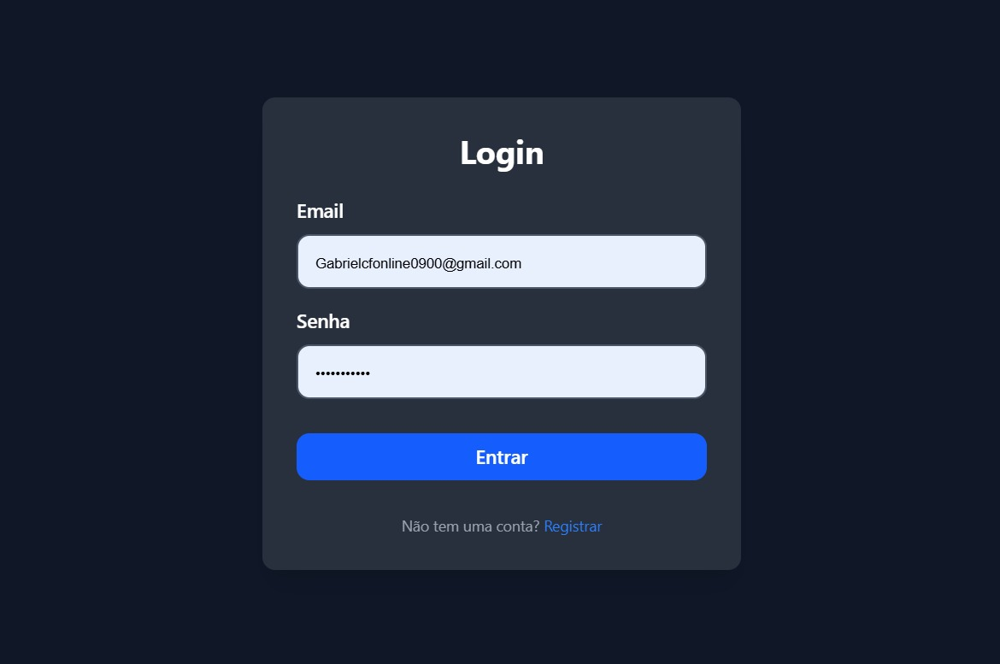
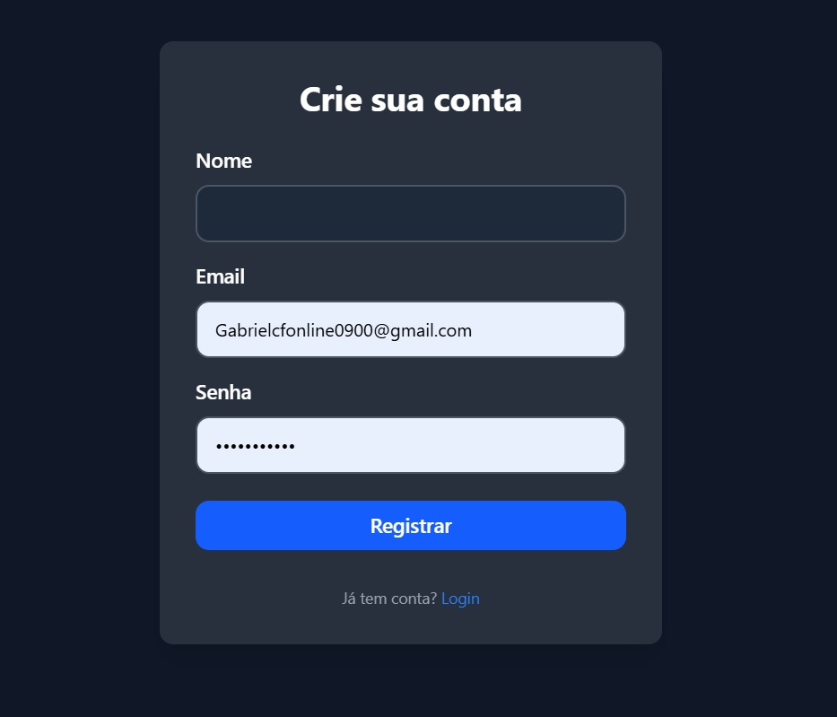
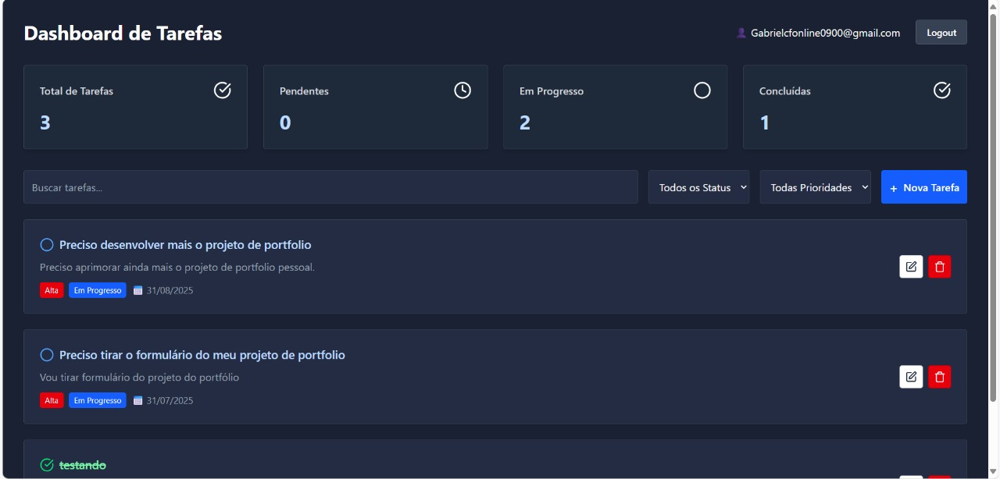
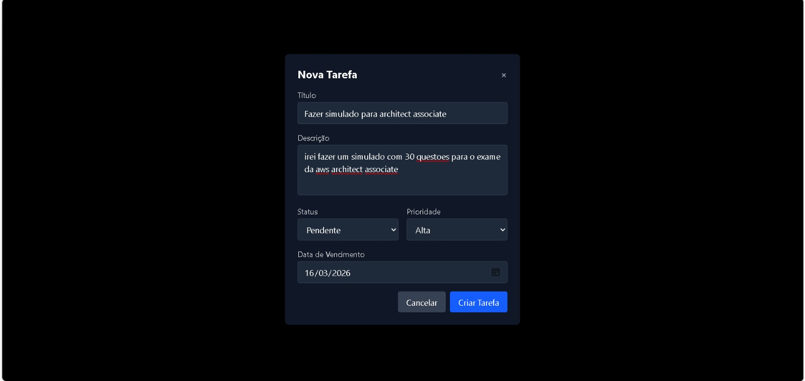
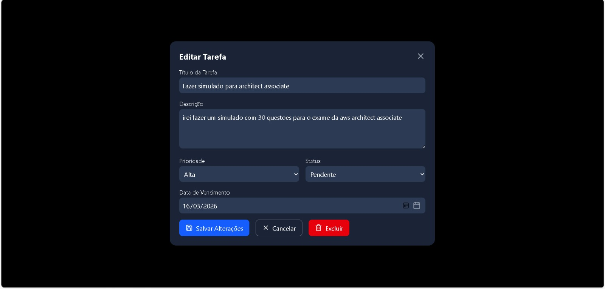
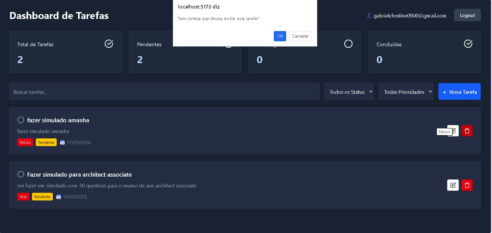

````markdown
# Tarefix

Tarefix é um sistema full stack de gerenciamento de tarefas com cadastro de usuários, autenticação por credenciais e operações de criação, listagem, edição e exclusão de tarefas. O projeto está organizado em três camadas principais: frontend web, backend em API REST e banco PostgreSQL.

## Visão Geral

O objetivo do sistema é permitir que cada usuário mantenha sua própria lista de tarefas, acompanhando status, prioridade, descrição e data de vencimento. A aplicação possui fluxo básico de acesso por login, armazenamento persistente em banco relacional e interface voltada para uso em navegador.

## Mapeamento do Projeto

### Estrutura por módulo

- Frontend: aplicação React com Vite responsável pelas telas de login, registro e dashboard de tarefas.
- Backend: API em Node.js com Express e TypeScript responsável pela regra de negócio, validações e acesso ao banco.
- Database: container PostgreSQL para persistência dos dados.
- Prisma: camada ORM usada para modelagem, migrações e operações no banco.

### Organização das pastas

- Frontend/src/pages: telas principais do sistema, como Login, Register e Dashboard.
- Frontend/src/components: componentes reutilizáveis, incluindo modais de criação e edição de tarefas.
- Frontend/src/services: configuração do cliente HTTP e chamadas de autenticação.
- Backend/src/api/controllers: controladores separados por contexto, como login, registro, criação de tarefa e CRUD.
- Backend/src/api/routes: definição das rotas expostas pela API.
- Backend/prisma: schema de dados e histórico de migrações.

## Configuração do Sistema

Esta seção define os principais arquivos e componentes que fazem parte da configuração técnica do projeto, incluindo código-fonte, banco de dados, dependências e scripts de execução.

### Arquivos de código-fonte

- package.json na raiz: centraliza scripts de orquestração do projeto, como execução de frontend, backend, build e envio com git push.
- Backend/server.ts: arquivo principal de inicialização da API Express, incluindo middlewares, CORS e carregamento das rotas.
- Backend/src/api/routes/routes.ts: concentrador das rotas HTTP do backend.
- Backend/src/api/controllers: implementa a lógica de negócio para registro, login e operações de tarefas.
- Backend/src/lib/prisma.ts: configuração de acesso ao banco via Prisma Client.
- Frontend/src/main.tsx e Frontend/src/App.tsx: ponto de entrada da aplicação React.
- Frontend/src/routes/routes.tsx: definição das rotas navegáveis da interface.
- Frontend/src/pages: telas principais do sistema.
- Frontend/src/components: componentes reutilizáveis da interface, incluindo formulários e modais.
- Frontend/src/services/api.ts: configuração do cliente Axios para comunicação com o backend.
- Frontend/src/services/auth.ts: serviços de autenticação consumidos pelas telas.

### Arquivos de banco de dados

- Backend/prisma/schema.prisma: define o modelo de dados, enums, relações e fonte de dados PostgreSQL.
- Backend/prisma/migrations: registra o histórico de migrações aplicadas ao banco.
- Database/Dockerfile: define o container PostgreSQL utilizado no ambiente do projeto.

### Arquivos de dependências e build

- package.json na raiz: define scripts globais para operação do projeto.
- Backend/package.json: define dependências e scripts do backend, como Express, Prisma, bcrypt e TypeScript.
- Frontend/package.json: define dependências e scripts do frontend, como React, Vite, Tailwind CSS, Axios e ESLint.
- Backend/tsconfig.json: configura a compilação TypeScript do backend e a geração de saída em dist.
- Frontend/tsconfig.json, Frontend/tsconfig.app.json e Frontend/tsconfig.node.json: configuram o ambiente TypeScript do frontend.
- Frontend/vite.config.ts: configura o processo de build e desenvolvimento do frontend com Vite.
- Frontend/eslint.config.js: configura as regras de qualidade e análise estática do frontend.

### Arquivos de execução e infraestrutura

- Backend/Dockerfile: define a imagem de execução do backend.
- Backend/docker-entrypoint.sh: apoia a inicialização do ambiente do backend em container.
- Frontend/Dockerfile: define a imagem de build e entrega da aplicação frontend.
- Frontend/nginx.conf: configura o Nginx usado para servir o frontend em produção.

### Scripts de execução do projeto

#### Scripts na raiz

- npm run dev:backend: executa o backend a partir da raiz.
- npm run dev:frontend: executa o frontend a partir da raiz.
- npm run build:backend: compila o backend.
- npm run build:frontend: gera o build do frontend.
- npm run push: executa git push a partir da raiz do repositório.

#### Scripts do backend

- npm run dev: inicia o servidor backend em modo de desenvolvimento.
- npm run build: compila o backend TypeScript para JavaScript.

#### Scripts do frontend

- npm run dev: inicia o servidor de desenvolvimento com Vite.
- npm run build: gera o build de produção do frontend.
- npm run lint: executa a análise estática do código.
- npm run preview: publica localmente o build gerado para validação.

### Modelo de dados atual

#### Usuário

- id
- name
- email
- password
- createdAt
- updatedAt

#### Tarefa

- id
- title
- description
- priority: Alta, Media ou Baixa
- status: Pendente, Em_Andamento ou Concluida
- date
- userId
- createdAt
- updatedAt

## Funcionalidades do Sistema

### Funcionalidades implementadas

- Cadastro de usuário com nome, email e senha.
- Validação de campos obrigatórios no cadastro.
- Bloqueio de cadastro com email duplicado.
- Criptografia de senha antes da gravação no banco.
- Login com validação de email e senha.
- Persistência básica da sessão no frontend por localStorage com userId e email.
- Criação de tarefas vinculadas a um usuário.
- Listagem de tarefas por usuário.
- Edição de título, descrição, status, prioridade e data da tarefa.
- Exclusão de tarefas.
- Busca textual de tarefas por título ou descrição no dashboard.
- Exibição de indicadores de resumo no dashboard: total, pendentes, em progresso e concluídas.
- Logout com limpeza dos dados salvos localmente.

### Rotas e fluxos principais

#### Frontend

- /login: autenticação do usuário.
- /register: cadastro de novo usuário.
- /dashboard: visualização e gerenciamento das tarefas.

#### Backend

- POST /api/auth/register: registra usuário.
- POST /api/auth/login: autentica usuário.
- POST /api/auth/nova-tarefa: cria nova tarefa.
- GET /api/auth/tarefas: lista tarefas por userId.
- PUT /api/auth/tarefas/:id: atualiza tarefa.
- DELETE /api/auth/tarefas/:id: remove tarefa.

## Requisitos Funcionais

Os requisitos funcionais descrevem o que o sistema deve fazer do ponto de vista do usuário e da regra de negócio.

- RF01. O sistema deve permitir o cadastro de usuários informando nome, email e senha.
- RF02. O sistema deve impedir o registro de usuários com email já cadastrado.
- RF03. O sistema deve permitir que usuários autenticados realizem login com email e senha válidos.
- RF04. O sistema deve informar mensagens de erro quando houver campos obrigatórios não preenchidos ou credenciais inválidas.
- RF05. O sistema deve permitir a criação de tarefas associadas a um usuário.
- RF06. O sistema deve permitir registrar, em cada tarefa, título, descrição, prioridade, status e data de vencimento.
- RF07. O sistema deve listar as tarefas de acordo com o usuário informado.
- RF08. O sistema deve permitir editar os dados de uma tarefa existente.
- RF09. O sistema deve permitir excluir uma tarefa cadastrada.
- RF10. O sistema deve permitir pesquisar tarefas por título ou descrição na tela principal.
- RF11. O sistema deve exibir um painel com indicadores quantitativos de tarefas por status.
- RF12. O sistema deve permitir encerrar a sessão do usuário no frontend por meio de logout.

## Requisitos Não Funcionais

Os requisitos não funcionais definem as características técnicas e de qualidade que a solução deve atender.

- RNF01. O sistema deve utilizar arquitetura separada entre frontend, backend e banco de dados.
- RNF02. O frontend deve ser desenvolvido com React e TypeScript, utilizando Vite como ferramenta de build.
- RNF03. O backend deve ser desenvolvido com Node.js, Express e TypeScript.
- RNF04. A persistência dos dados deve ser realizada em PostgreSQL com apoio do Prisma ORM.
- RNF05. As senhas dos usuários devem ser armazenadas de forma criptografada com bcrypt.
- RNF06. A comunicação entre frontend e backend deve ocorrer por API REST com troca de dados em JSON.
- RNF07. O backend deve aplicar validações mínimas de entrada, incluindo campos obrigatórios, formato de email e validação de data.
- RNF08. O sistema deve permitir execução em ambiente containerizado por meio de Docker para os serviços principais.
- RNF09. O frontend deve apresentar interface adaptável para uso em diferentes tamanhos de tela.
- RNF10. O backend deve restringir chamadas cross-origin aos domínios explicitamente configurados via CORS.
- RNF11. O código-fonte deve permanecer organizado em módulos por responsabilidade, facilitando manutenção e evolução.

## Stack Tecnologica

### Frontend

- React 19
- TypeScript
- Vite
- Tailwind CSS
- React Router
- Axios
- Zod
- Lucide React

### Backend

- Node.js
- Express
- TypeScript
- Prisma ORM
- PostgreSQL
- bcrypt e bcryptjs
- CORS

### Infraestrutura

- Docker para frontend, backend e banco de dados.
- Nginx para entrega do frontend em ambiente containerizado.

## Como Executar o Projeto

### Pré-requisitos

- Node.js instalado.
- Docker instalado.
- Banco PostgreSQL disponível localmente ou por container.

### Backend

1. Acesse a pasta Backend.
2. Instale as dependências com npm install.
3. Configure a variável DATABASE_URL no ambiente.
4. Execute as migrações com npx prisma migrate dev.
5. Inicie a aplicação com npm run dev.

O backend sobe na porta 3000 e expõe as rotas sob o prefixo /api/auth.

### Frontend

1. Acesse a pasta Frontend.
2. Instale as dependências com npm install.
3. Execute npm run dev.
4. Acesse a aplicação no endereço informado pelo Vite, normalmente http://localhost:5173.

## Observações Sobre o Escopo Atual

- O projeto possui autenticação por login e senha, mas não utiliza JWT ou middleware de proteção de rotas no backend.
- O frontend salva userId e email no localStorage para manter o contexto do usuário.
- Existem seletores visuais de filtro por status e prioridade no dashboard, mas a filtragem efetiva implementada atualmente é apenas por texto.

## Imagens do Sistema

### 1. Tela de Login

Descrição:
Apresenta o formulário de autenticação do usuário, com campos para email e senha, validação de entrada e acesso ao fluxo de registro para novos usuários.



### 2. Tela de Cadastro

Descrição:
Exibe o formulário de criação de conta com os campos nome, email e senha. Essa tela representa o ponto de entrada para novos usuários no sistema.



### 3. Dashboard de Tarefas

Descrição:
Mostra o painel principal do sistema, com listagem de tarefas, busca textual, indicadores de resumo por status e ações para criar, editar, excluir e acompanhar atividades cadastradas.



### 4. Modal de Criação de Tarefa

Descrição:
Interfaz modal que permite ao usuário criar uma nova tarefa, preenchendo informações como título, descrição, prioridade (Alta, Média ou Baixa), status (Pendente, Em Andamento ou Concluída) e data de vencimento. O modal oferece uma experiência focada e isolada para essa operação.



### 5. Modal de Edição de Tarefa

Descrição:
Interfaz modal que permite editar uma tarefa existente, alterando seu título, descrição, prioridade, status e data de vencimento. Funciona de forma similar ao modal de criação, mas com campos preenchidos com os dados atuais da tarefa.



### 6. Modal de Exclusão de Tarefa

Descrição:
Interfaz modal de confirmação que aparece quando o usuário deseja deletar uma tarefa. O modal avisa sobre a ação irreversível e solicita confirmação antes de executar a exclusão da tarefa do sistema.


